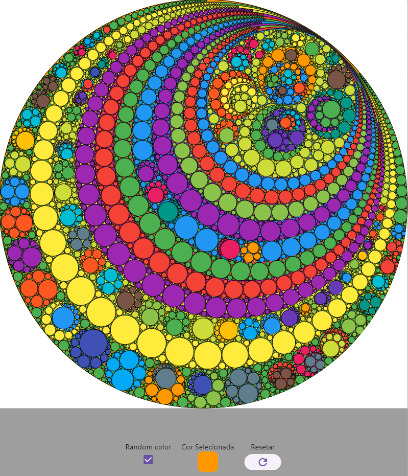

# Apollonian Gasket

    

A small study project on the Apollonian Gasket fractal, which consists of creating a new tangential circle from 3 tangential circles and then continuing to create tangentials circles for every 3 previous ones.

[Apollonian Gasket Fractal](https://en.wikipedia.org/wiki/Apollonian_gasket)

This project was inspired by a lesson from Professor [The Coding Train](https://www.youtube.com/watch?v=6UlGLB_jiCs), including much of the complex number code he uses, although the generation of circles does not have a direct relationship.

## Creation Methods

1. A first circle is created with a diameter based on the smallest available measurement on the display.
2. Based on click or drag/pan, an internal circle is created with its center at the point and a radius tangential to the external circle.
3. Then a second internal circle is created with a radius equal to the difference between the diameter of the external circle and the diameter of the first internal circle, its center is positioned at the angle between the two centers using trigonometry and the properties of the unit circle.
4. Using the three tangential circles, [Descartes' Theorem](https://en.wikipedia.org/wiki/Descartes%27_theorem) is applied to find the curvature of the next tangentials circles.
5. With the curvatures of the new tangentials circles, the possible centers of these new circles are calculated using the complex Descartes' Theorem.
6. With the new circles in hand, a loop is created to generate new tangential circles for each set of 3 new tangential circles.

## Project Structure

The project used Signals for state control and a simple division of entity objects from the interface.

## Observations

- The quadratic formulas were taken directly from the Wikipedia article <https://en.wikipedia.org/wiki/Descartes%27_theorem>.
- Dart provides packages with classes for complex numbers, but following the Coding Train professor's video, I created my own class for study purposes, although much of the code was observed in the same video's code.
- All interface and circle creation methods were kept in the same file [home_screen.dart](lib\presentation\home_screen.dart) to facilitate those who wish to study the code.

## Example

- The project was tested and is more functional when considering a Windows application.
- But it also runs on the web platform (example below); however, on mobile browsers, the experience is greatly reduced, both due to the interface size, performance, and the lack of mouse finesse.

